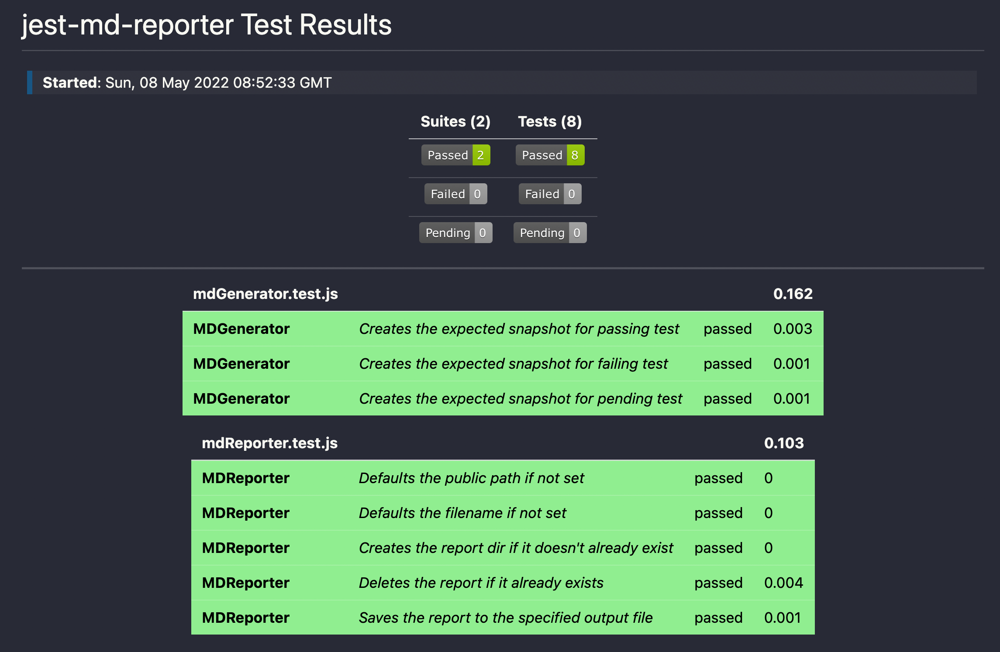

# jest-gh-md-reporter

This daft little package hooks into your node project and outputs your test results to a markdown file.

## Configuration

To install this reporter and get going, it should be as simple as:

```bash
npm i jest-gh-md-reporter
```

And theeeeeeen:

```json
	"jest": {
        // Truncated for brevity
		"reporters": [
			"default",
			[
				"jest-gh-md-reporter",
				{
					"filename": "test-report.md",
					"publicPath": "./test-reports"
				}
			]
		]
	},
```

This'll give you some lovely test output that looks like:



## Contribution

This was put together over a very hungover Saturday. Totally down for contribution, hit me up!
